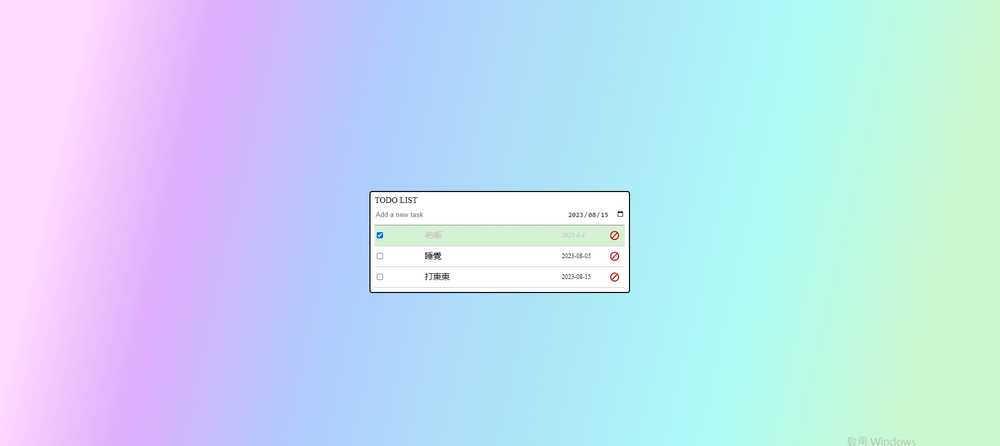

# ✨ 買賣力道比例基地

## 頁面截圖：

## 👋 功能說明

本專案為 react-redux 練習製作小東西

備註:

## 👋 使用說明

1.  確認已經安裝 node.js 與 npm
2.  clone 專案
3.  終端機進入資料夾並輸入：`$ npm install `
4.  安裝完畢後，繼續輸入：`$ npm run start`

## 👋 開發工具

    "@testing-library/jest-dom": "^5.17.0",
    "@testing-library/react": "^13.4.0",
    "@testing-library/user-event": "^13.5.0",
    "clsx": "^2.0.0",
    "gh-pages": "^4.0.0",
    "react": "^18.2.0",
    "react-dom": "^18.2.0",
    "react-icons": "^4.10.1",
    "react-redux": "^8.1.2",
    "react-scripts": "5.0.1",
    "redux": "^4.2.1",
    "sass": "^1.64.2",
    "web-vitals": "^2.1.4"
